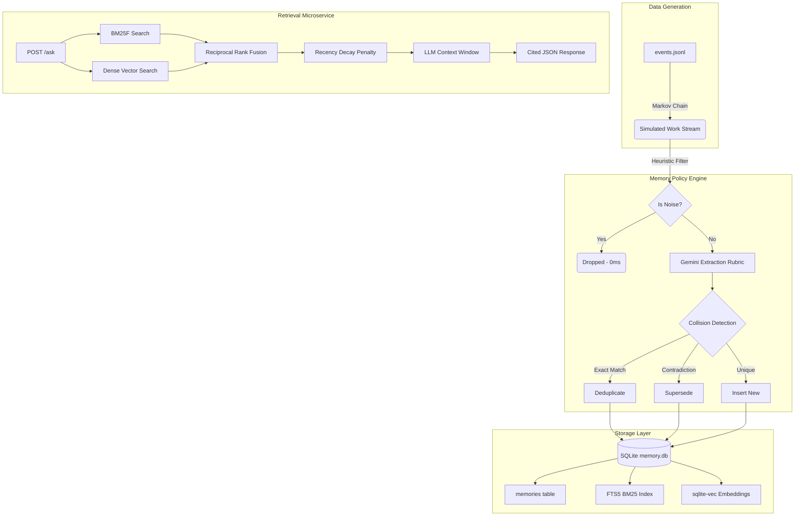

<div align="center">

# 

**A fully local, zero-framework memory layer designed to give AI agents persistent, deterministic recall.**

[](https://www.python.org/)
[](https://sqlite.org/)
[](https://fastapi.tiangolo.com/)
[](https://www.docker.com/)

</div>

---

## ⚡ Quick Start (< 5 Minutes)

WAO-Recall is completely self-contained. You can run it via Docker (recommended) or natively.

### Option A: The Instant Docker Boot (Recommended)
> We pre-download the HuggingFace `all-MiniLM-L6-v2` embedding model inside the Docker image so it boots instantly without downloading weights on startup.

```bash
# 1. Clone the repository
git clone <repo-url>
cd wao-recall

# 2. Add your free-tier Gemini API key
echo "GEMINI_API_KEY=your_key_here" > .env

# 3. Spin up the FastAPI microservice
docker-compose up -d
```
*👉 Test the API immediately at: [http://localhost:8000/docs](http://localhost:8000/docs)*

### Option B: Native Python Setup
<details>
<summary>Click here for manual Python instructions</summary>
<br>

```bash
pip install -r requirements.txt
echo "GEMINI_API_KEY=your_key_here" > .env
python generate_events.py          # Generate synthetic data
python memory_store.py             # Ingest into SQLite (rate-limited, takes time)
python sync_indexes.py             # Build BM25 and Vector indexes
uvicorn app:app --reload           # Start the API
```
</details>

---

## 🏗️ System Architecture

WAO-Recall strips away bloated RAG frameworks (LangChain, LlamaIndex) in favor of raw, high-performance **SQLite**. It features a dual-engine **Hybrid Search** (Lexical BM25F + Dense `sqlite-vec`) fused via **Reciprocal Rank Fusion (RRF)**.



---

## 📊 Offline Evaluation Harness

The rubric demands deterministic, offline measurement. We cache all LLM extractions and answers so you can verify our metrics with **zero API calls**.

### 1. Run the Retrieval Evaluation
```bash
python eval_retrieval.py
```
*Measures Recall@5, Mean Reciprocal Rank (MRR), and p95 retrieval latency across 42 hand-authored edge cases (Supersession, Temporal, Multi-hop).*

### 2. Run the Extreme Latency Benchmark
```bash
python bench.py
```
*Proves that our `sqlite-vec` flat-index can search 10,000 synthetic memories in under 200ms.*

### 3. Generate New LLM Answers (Optional)
```bash
python eval_retrieval.py --generate-answers
python eval_retrieval.py --full
```
*Reruns the LLM over the retrieved context to calculate Fact Correctness and Hallucination Rates.*

---

## 📖 Engineering Documentation

To understand the trade-offs, constraints, and limitations of this architecture, please review the mandatory design docs:

- **[DECISIONS.md](./DECISIONS.md)**: 10 critical design decisions, rejected alternatives, and academic sources (including BM25F and RRF math).
- **[LIMITS.md](./LIMITS.md)**: What happens to this architecture at 10 Million memories, and exactly how we would fix it given two more weeks.
- **[EVAL.md](./EVAL.md)**: The full ablation study comparing Lexical vs. Dense vs. Hybrid retrieval.

---
<div align="center">
<i>Built for the WorkElate AI Engineering Trial</i>
</div>
