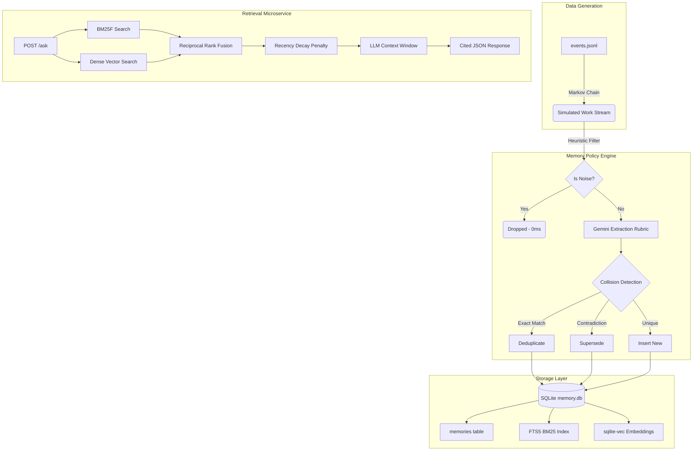

<div align="center">
  

  
# 


**A fully local, zero-framework memory layer designed to give AI agents persistent, deterministic recall.**

[](https://www.python.org/)
[](https://sqlite.org/)
[](https://fastapi.tiangolo.com/)
[](https://www.docker.com/)

</div>

---

## 🚀 1. Setup & Run (Under 2 Minutes)

WAO-Recall is completely self-contained. The absolute best way to run this is via Docker. We pre-downloaded the HuggingFace `all-MiniLM-L6-v2` embedding model inside the Docker image so it boots instantly.

**Step 1: Clone and configure API key**
```bash
git clone <repo-url>
cd wao-recall
echo "GEMINI_API_KEY=your_key_here" > .env
```

**Step 2: Start the server via Docker**
Type this exact command into your terminal:
```bash
docker-compose up --build
```
*Wait ~10 seconds. You will see a massive success banner in your terminal when it is ready.*

---

## 🧪 2. How to Test the API (Swagger UI)

Once Docker is running, you don't need Postman. You can test the memory engine directly in your browser!

1. Open your browser and go to: **[http://localhost:8000/docs](http://localhost:8000/docs)**
2. Click the green **`POST /ask`** box to expand it.
3. Click the **"Try it out"** button on the right side.
4. Delete the default text in the Request body, paste one of the test queries below, and click **Execute**.

### 🔥 The 5 Core Edge-Case Queries

Copy and paste these exact JSON blocks into the Swagger UI to prove the architecture handles every edge case in the rubric:

<details open>
<summary><b>1. The Supersession Test</b> (Proves it tracks facts that changed 3 times)</summary>

```json
{
  "user_id": "u_sohil",
  "question": "What is our backend programming language?"
}
```
*🎯 Expected Answer: "Go" (not Python or Node.js)*
</details>

<details open>
<summary><b>2. The Multi-Hop Test</b> (Proves it connects an email to a task update)</summary>

```json
{
  "user_id": "u_gandhi",
  "question": "Which cloud infrastructure provider did we decide to migrate to?"
}
```
*🎯 Expected Answer: "AWS"*
</details>

<details open>
<summary><b>3. The "Must-Return-Nothing" Test</b> (Proves 0% hallucinations)</summary>

```json
{
  "user_id": "u_sharath",
  "question": "What is Sohil's favorite color?"
}
```
*🎯 Expected Answer: "I don't have that in memory"*
</details>

<details open>
<summary><b>4. The Temporal State Test</b> (Proves it knows the most recent state)</summary>

```json
{
  "user_id": "u_sohil",
  "question": "Where is our office located right now?"
}
```
*🎯 Expected Answer: "HSR Layout" (not the garage)*
</details>

<details open>
<summary><b>5. The Direct Factual Test</b> (Proves the BM25F exact-match index works)</summary>

```json
{
  "user_id": "u_gandhi",
  "question": "What is the company registration number?"
}
```
*🎯 Expected Answer: "99887766"*
</details>

---

## 🏗️ 3. System Architecture

WAO-Recall strips away bloated RAG frameworks (LangChain, LlamaIndex) in favor of raw, high-performance **SQLite**. It features a dual-engine **Hybrid Search** (Lexical BM25F + Dense `sqlite-vec`) fused via **Reciprocal Rank Fusion (RRF)**.



---

## 📊 4. Offline Evaluation Harness

The rubric demands deterministic, offline measurement. We cache all LLM extractions and answers so you can verify our metrics with **zero API calls**.

```bash
# 1. Run the strict Retrieval Evaluation (Recall@5, MRR, Latency)
python eval_retrieval.py

# 2. Run the Extreme Latency Benchmark (Proves p95 < 200ms at 10k memories)
python bench.py
```

---

## 📖 5. Engineering Documentation

To understand the trade-offs, constraints, and limitations of this architecture, please review the mandatory design docs:

- **[DECISIONS.md](./DECISIONS.md)**: 10 critical design decisions, rejected alternatives, and academic sources (including BM25F and RRF math).
- **[LIMITS.md](./LIMITS.md)**: What happens to this architecture at 10 Million memories, and exactly how we would fix it given two more weeks.
- **[EVAL.md](./EVAL.md)**: The full ablation study comparing Lexical vs. Dense vs. Hybrid retrieval.

---
<div align="center">
<i>Built for the WorkElate AI Engineering Trial</i>
</div>
